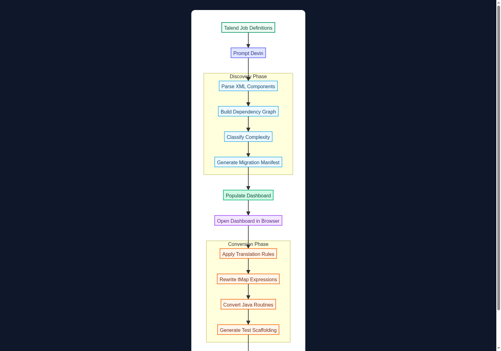
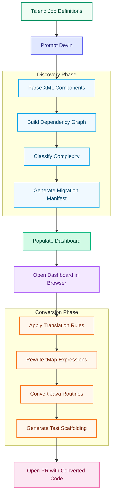

# Talend ETL to Python/Snowflake Migration Demo

AI agent parses a portfolio of Talend ETL job definitions, builds a complete job inventory with dependency graphs and complexity classifications, converts jobs to Python/Snowpark, and generates an interactive discovery dashboard.

[](docs/flowchart.html)

<details>
<summary>View inline flowchart</summary>



</details>

[View interactive flowchart (HTML)](docs/flowchart.html)

## What This Demo Shows

A financial services organization runs 14 Talend ETL jobs across 5 business domains — customer accounts, loan processing, payment reconciliation, regulatory reporting (CFPB/OCC), and data quality. These jobs use complex tMap expressions with nested ternaries, custom Java routines for financial calculations and account validation, multi-source joins, and cross-database flows (Oracle → Snowflake). A previous vendor achieved only 40-50% automated migration success. This demo shows Devin achieving full discovery and conversion in a single live session.

## What Devin Does Live

Devin parses every `.item` XML file, extracts the component graph (nodes, connections, schemas, tMap expressions), builds a cross-job dependency map via shared table references, classifies each job by conversion complexity (scoring expression depth, routine usage, join count, and cross-database patterns), generates a migration manifest, populates an interactive dashboard with charts and tables, then converts each job to Python/Snowpark using the component-level translation rules in [`conversion-playbook.md`](conversion-playbook.md) — including rewriting tMap expressions to Snowpark functions, converting custom Java routines to Python, and generating unit test scaffolding for each converted job.

## How the Demo Runs

**Trigger:** Open a Devin session on this repo and prompt Devin to analyze the Talend portfolio, populate the dashboard, and convert jobs to Python.

Devin runs the analysis pipeline end-to-end:
1. `python scripts/parse_talend_xml.py talend_jobs/` — parses all 14 `.item` files, extracts component graphs
2. `python scripts/build_dependency_graph.py analysis_output/` — maps cross-job dependencies via shared tables
3. `python scripts/classify_complexity.py analysis_output/` — scores and classifies each job
4. `python scripts/generate_manifest.py analysis_output/` — combines into migration manifest
5. Opens `dashboard/index.html` — shows populated charts, tables, heatmap
6. Converts jobs to Python/Snowpark in `python_target/`, using rules from `conversion-playbook.md`
7. Opens a PR with all converted code and test scaffolding

## Repo Layout

```
talend_jobs/               14 Talend .item XML files across 5 domains
  customer_accounts/       Extract, validate, dimension load (SCD Type 2)
  loan_processing/         Application ingest, risk scoring, status update
  payment_reconciliation/  Payment matching, discrepancy reports, settlement
  regulatory_reporting/    CFPB extract, OCC compliance, regulatory archive
  data_quality/            Address standardization, customer dedup
routines/                  3 custom Java routines (date, amount, validation)
scripts/                   Python analysis scripts (parse, deps, complexity, manifest)
dashboard/                 Interactive HTML/JS discovery dashboard
python_target/             Empty — Devin populates during live demo
docs/                      Implementation plan, flowchart
conversion-playbook.md     Component-level translation rules (Talend → Python)
```

## Key Concepts

| Term | Meaning |
|---|---|
| `.item` file | Talend's XML job definition format (EMF/XMI serialization) |
| `tMap` | Talend's visual mapping component — column transforms, joins, filters |
| `nodeData` / `mapperTableEntries` | tMap's internal expression definitions |
| `tDBInput` / `tDBOutput` | Database read/write components |
| `tFileInputDelimited` | CSV/flat file reader component |
| `contextParameter` | Runtime configuration variable (connection strings, dates, thresholds) |
| `routinesParameter` | Reference to built-in or custom Java routine |
| Snowpark | Snowflake's DataFrame API for Python — the target runtime |
| SCD Type 2 | Slowly Changing Dimension — historical tracking pattern |
| DTI / LTV | Debt-to-Income / Loan-to-Value ratios (financial metrics) |
